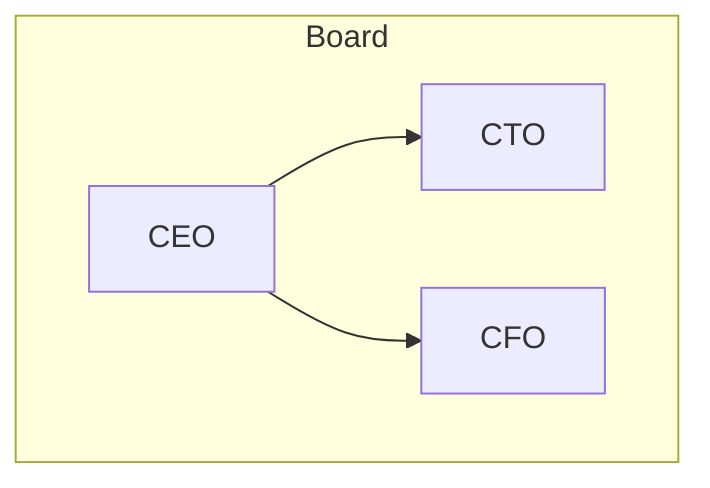

# AksaraDraw Complete Feature Guide

**Version:** 1.1
**Date:** 2025-10-13

## Overview

AksaraDraw now supports **mixed horizontal and vertical layouts** within a single organization chart, allowing you to create complex, professional diagrams with fine-grained control over child node arrangement.

## New Features

### 1. Horizontal Child Layout

You can now specify that a node's children should be arranged **horizontally** (side-by-side) instead of the default vertical arrangement.

**Syntax:**
```aksara-org
Parent > [Child1, Child2, Child3] (horizontal)
```

**Short form:**
```aksara-org
Parent > [Child1, Child2, Child3] (h)
```

### 2. Mixed Vertical and Horizontal Layouts

Combine both layout types in a single diagram for maximum flexibility:

```aksara-org
CEO > [CTO, CFO, COO]
CTO > [Engineering, Product, Design] (h)
CFO > [Accounting, Finance, Tax] (h)
COO > [Operations, Logistics, Supply Chain] (h)
```

**Result:**
- CEO at top with 3 children arranged vertically
- Each director has their teams arranged horizontally

### 3. Large Complex Diagrams

Create comprehensive organizational charts with multiple levels and mixed layouts:

```aksara-org
Direktur Utama > [Direktur Komersial, Direktur Operasi, Direktur Keuangan, Direktur SDM] (h)
Direktur Komersial > [Sales, Marketing, Business Development] (h)
Direktur Operasi > [Operations, Quality, Customer Service] (h)
Direktur Keuangan > [Accounting, Finance, Treasury] (h)
Direktur SDM > [Recruitment, Training, Payroll] (h)
```

## Usage Examples

### Example 1: Traditional Vertical Hierarchy

```aksara-org
CEO > [CTO, CFO, COO]
CTO > [VP Engineering, VP Product]
VP Engineering > [Director Backend, Director Frontend, Director Mobile]
```

**Output:** Classic org chart with vertical stacking

### Example 2: Flat Structure with Horizontal Departments

```aksara-org
Director > [Team A, Team B, Team C, Team D, Team E] (horizontal)
```

**Output:** Director at top, all teams in a single horizontal row

### Example 3: Mixed Layout (IAS Style)

```aksara-org
Direktur Utama > [Direktur Komersial, Direktur Operasi, Direktur Resiko]
Direktur Komersial > [Commercial Development, Strategic Sales, Business Performance] (h)
Direktur Operasi > [Operation Excellence, Customer Experience, Business Portfolio] (h)
Direktur Resiko > [Risk Management, Legal, Procurement] (h)
```

**Output:**
- Board directors arranged vertically
- Each director's departments arranged horizontally
- Professional, space-efficient layout

### Example 4: Deep Hierarchy with Mixed Layouts

```aksara-org
SBU Cargo > [Cargo Service, Logistics, Support]
Cargo Service > [GM Service, Sales, Operations] (h)
GM Service > [Regional KNO, Regional CGK, Regional DPS] (h)
Logistics > [Air Express, Freight Forwarder, Contract Logistics] (h)
Support > [Finance, HR, IT] (h)
```

**Output:**
- 3 main divisions vertical
- Each division's departments horizontal
- Sub-departments also horizontal
- Compact and readable

## Layout Behavior

### Default (Vertical)

When no layout is specified, children are arranged with **vertical stacking**:
- Each child gets full width of its subtree
- Children spread horizontally to accommodate their own children
- Good for deep hierarchies

### Horizontal Layout

When `(horizontal)` or `(h)` is specified:
- Children arranged side-by-side in a single row
- Minimal spacing (30px gap)
- Parent centered above children
- Good for showing peer relationships

### Mixed Layouts

- Each parent can independently specify its children's layout
- Grandchildren can have different layout from their parents
- Create complex structures matching your organization

## Visual Improvements

All diagrams benefit from recent improvements:
- ✅ **No overlapping nodes** - Proper spacing calculations
- ✅ **Curved arrows** - Smooth Bézier curves
- ✅ **Thin lines** - 1.5px stroke width
- ✅ **Soft colors** - #666 gray instead of black
- ✅ **Dynamic sizing** - Nodes auto-size to content

## Comparison: Vertical vs Horizontal

### Scenario 1: Board of Directors

**Vertical (Default):**
```
            CEO
             |
    +--------+--------+
    |        |        |
   CTO      CFO      COO
```
- Good when directors have different sized teams
- Natural top-down flow

**Horizontal:**
```
         CEO
          |
   +------+------+------+
   |      |      |      |
  CTO    CFO    COO   CSO
```
- Good for showing equal-level peers
- More compact horizontally
- Emphasizes flat structure

### Scenario 2: Departments

**Vertical:**
```
    Director
        |
    +---+---+
    |       |
  Dept A  Dept B
    |       |
  Team1   Team2
```
- Shows hierarchical depth
- Good for command chains

**Horizontal:**
```
    Director
        |
    +---+---+---+
    |   |   |   |
   D1  D2  D3  D4
```
- Shows breadth
- Good for functional divisions
- Space-efficient

## Best Practices

### 1. Use Horizontal for Peers
```aksara-org
Manager > [Employee A, Employee B, Employee C, Employee D] (h)
```
Shows these are equal-level peers

### 2. Use Vertical for Hierarchy Depth
```aksara-org
CEO > [VP Sales, VP Engineering]
VP Engineering > [Director Backend, Director Frontend]
Director Backend > [Team Lead API, Team Lead Database]
```
Shows clear chain of command

### 3. Mix for Complex Organizations
```aksara-org
CEO > [Sales Division, Tech Division, Finance Division]
Tech Division > [Engineering, Product, Design] (h)
Engineering > [Backend Team, Frontend Team, Mobile Team] (h)
```
Balances vertical hierarchy with horizontal breadth

### 4. Keep Horizontal Lists Reasonable
- **Good:** 2-6 items horizontally
- **Acceptable:** 7-8 items horizontally
- **Consider vertical:** 9+ items (or split into subgroups)

## Technical Details

### Parser Enhancement
- Detects `(horizontal)`, `(h)`, `(vertical)`, or `(v)` options
- Stores in node metadata as `childLayout` property
- Backwards compatible (no options = default vertical)

### Layout Algorithm
- Horizontal: Places children side-by-side at same Y level
- Vertical: Each child gets its own horizontal space band
- Mixed: Each parent's children obey its layout directive
- Spacing: 30px minimum gap between adjacent nodes

### Rendering
- Same curved arrows for both layouts
- Arrows adjust to horizontal or vertical arrangement
- Maintains visual consistency

## File Examples

See these test files for working examples:
- `test/IASComplete.md` - Full IAS organization with mixed layouts
- `test/AksaraDrawTest.md` - Basic vertical layouts
- `test/AksaraDrawComplex.md` - Multiple separate diagrams

## Migration from Mermaid

### Mermaid Subgraphs → AksaraDraw

**Before (Mermaid):**


**After (AksaraDraw):**
```aksara-org
CEO > [CTO, CFO] (horizontal)
```

### Mermaid Direction → AksaraDraw

| Mermaid | AksaraDraw | Notes |
|---------|------------|-------|
| `direction TB` | Default | Vertical stacking |
| `direction LR` | `(horizontal)` | Side-by-side |
| Mixed in subgraphs | Per-node `(h)` | More flexible |

## Limitations

### Current
- No diagonal connections
- No circular/radial layouts
- Horizontal layout doesn't support different Y levels for siblings

### Planned (Future)
- Configurable gap sizes
- Custom arrow routing
- Connection styling per-edge
- Node grouping/containers

## Summary

**New Capabilities:**
- ✅ Horizontal child arrangement
- ✅ Vertical child arrangement (default)
- ✅ Mixed layouts in single diagram
- ✅ Complex multi-level hierarchies
- ✅ Space-efficient rendering

**Syntax:**
```aksara-org
Parent > [Child1, Child2, Child3] (h)    # Horizontal
Parent > [Child1, Child2, Child3] (v)    # Vertical (explicit)
Parent > [Child1, Child2, Child3]        # Vertical (default)
```

**Use Cases:**
- Corporate org charts
- Department structures
- Project teams
- Reporting relationships
- Matrix organizations

---

**Version:** AksaraDraw 1.1
**Status:** Production Ready ✅
