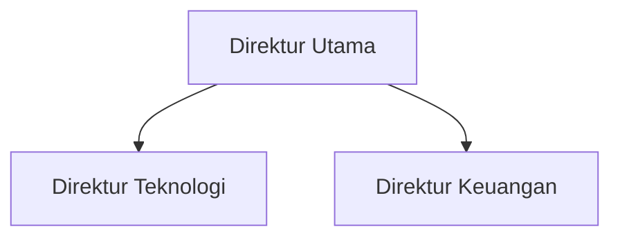
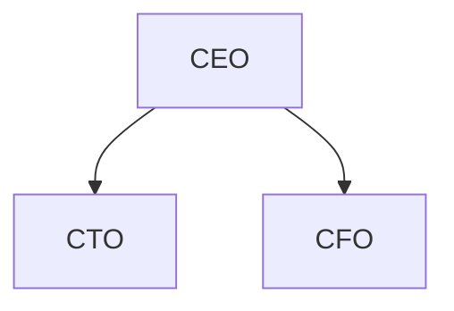
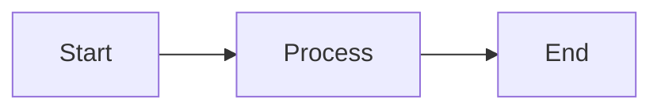

# AksaraDraw - Lightweight SVG Diagram Library

**Status:** Planning Phase
**Goal:** Replace Mermaid.js (700KB) with config-driven diagram engine (5KB)
**Target:** 80% feature coverage, 140x size reduction, unlimited diagram types via config

---

## 1. Problem Statement

### Current Situation (Mermaid.js)

**aksara-writer** currently uses Mermaid.js for diagram rendering:

```typescript
// packages/core/src/index.ts:159-161
if (trimmedLang === 'mermaid') {
  codeHtml = `<pre class="mermaid">${code.trim()}</pre>`;
}
```

**Issues:**
- ❌ **Bundle Size:** ~700KB minified (huge for simple diagrams)
- ❌ **Limited Customization:** Theme-based styling only
- ❌ **Verbose Syntax:** Different DSL per diagram type
- ❌ **Load Time:** ~200ms for library initialization
- ❌ **Not Indonesian-Focused:** Generic business templates

### Proposed Solution (AksaraDraw)

**Universal config-based diagram engine:**

```typescript
interface UniversalDiagram {
  type: 'flowchart' | 'org' | 'sequence' | 'timeline';
  nodes: Node[];
  edges: Edge[];
  layout: LayoutConfig;
}
```

**Benefits:**
- ✅ **Tiny:** ~5KB (140x smaller)
- ✅ **Programmatic:** Generate diagrams from database/API
- ✅ **Unified:** All diagrams use same data structure
- ✅ **Customizable:** Direct SVG/CSS control
- ✅ **Indonesian-Focused:** Business-specific shapes and layouts

---

## 2. Core Architecture

### 2.1 Three-Layer Design

```
┌─────────────────────────────────────┐
│  Parser Layer                       │
│  - Text syntax → AST                │
│  - JSON config validation           │
└──────────────┬──────────────────────┘
               │
┌──────────────▼──────────────────────┐
│  Layout Layer                       │
│  - Tree (org charts, flowcharts)    │
│  - Sequence (timeline interactions) │
│  - Grid (simple fallback)           │
│  - Force (optional, complex graphs) │
└──────────────┬──────────────────────┘
               │
┌──────────────▼──────────────────────┐
│  Renderer Layer                     │
│  - SVG builder                      │
│  - Shape library (rect, circle, etc)│
│  - Text sizing (dynamic dimensions) │
│  - Arrow routing                    │
└─────────────────────────────────────┘
```

### 2.2 Data Structures

```typescript
// Core node definition
interface Node {
  id: string;                    // Unique identifier
  label: string;                 // Display text
  shape?: 'rect' | 'circle' | 'diamond' | 'custom';
  x?: number;                    // Auto-calculated if omitted
  y?: number;                    // Auto-calculated if omitted
  width?: number;                // Auto-sized based on text
  height?: number;               // Auto-sized based on text
  style?: {
    fill?: string;
    stroke?: string;
    strokeWidth?: number;
    fontSize?: number;
  };
  metadata?: Record<string, any>; // Custom data for extensions
}

// Core edge definition
interface Edge {
  id?: string;
  from: string;                  // Node ID
  to: string;                    // Node ID
  label?: string;
  type?: 'solid' | 'dashed' | 'dotted' | 'arrow';
  style?: {
    stroke?: string;
    strokeWidth?: number;
  };
}

// Layout configuration
interface LayoutConfig {
  algorithm: 'tree' | 'grid' | 'force' | 'sequence' | 'manual';
  direction?: 'TB' | 'LR' | 'RL' | 'BT';  // Top-Bottom, Left-Right, etc
  spacing?: {
    x: number;                   // Horizontal spacing between nodes
    y: number;                   // Vertical spacing between nodes
  };
  padding?: number;              // Canvas padding
}

// Universal diagram format
interface UniversalDiagram {
  type: 'flowchart' | 'org' | 'sequence' | 'timeline' | 'custom';
  nodes: Node[];
  edges: Edge[];
  layout: LayoutConfig;
  canvas?: {
    width?: number;              // Auto-calculated if omitted
    height?: number;             // Auto-calculated if omitted
    background?: string;
  };
}
```

### 2.3 Extensibility Model

```typescript
// Custom shape registration
AksaraDraw.registerShape('badge', (x, y, w, h, text, style) => {
  return `
    <g class="shape-badge">
      <polygon points="${x},${y} ${x+w},${y} ${x+w-10},${y+h/2}
                        ${x+w},${y+h} ${x},${y+h}"
               fill="${style.fill}" stroke="${style.stroke}"/>
      <text x="${x+w/2}" y="${y+h/2}" text-anchor="middle">${text}</text>
    </g>
  `;
});

// Custom layout algorithm
AksaraDraw.registerLayout('radial', (nodes, edges, config) => {
  const positioned = nodes.map((node, i) => {
    const angle = (i / nodes.length) * 2 * Math.PI;
    const radius = 200;
    return {
      ...node,
      x: Math.cos(angle) * radius,
      y: Math.sin(angle) * radius
    };
  });
  return positioned;
});
```

---

## 3. Layout Algorithms

### 3.1 Tree Layout (Priority 1) - ~80 lines

**Use Cases:** Org charts, flowcharts, hierarchies

**Algorithm:**
```typescript
function layoutTree(nodes: Node[], edges: Edge[], config: LayoutConfig) {
  // 1. Build tree structure from edges
  const tree = buildTreeFromEdges(edges);

  // 2. Calculate subtree widths (bottom-up)
  function calculateWidth(node: TreeNode): number {
    if (node.children.length === 0) return 1;
    return node.children.reduce((sum, child) => sum + calculateWidth(child), 0);
  }

  // 3. Position nodes (top-down)
  function positionNode(node: TreeNode, x: number, y: number, offset: number) {
    node.x = x;
    node.y = y;

    let childOffset = offset;
    node.children.forEach(child => {
      const childWidth = calculateWidth(child);
      const childX = childOffset + (childWidth * config.spacing.x) / 2;
      positionNode(child, childX, y + config.spacing.y, childOffset);
      childOffset += childWidth * config.spacing.x;
    });

    // Center parent above children
    if (node.children.length > 0) {
      const firstChild = node.children[0];
      const lastChild = node.children[node.children.length - 1];
      node.x = (firstChild.x + lastChild.x) / 2;
    }
  }

  positionNode(tree.root, 0, 0, 0);
  return tree.flatten();
}
```

**Complexity:** O(n) where n = number of nodes
**Limitations:** Only works for tree structures (no cycles)
**Quality:** ⭐⭐⭐⭐⭐ (perfect for hierarchies)

### 3.2 Grid Layout (Priority 1) - ~30 lines

**Use Cases:** Simple diagrams, fallback option

**Algorithm:**
```typescript
function layoutGrid(nodes: Node[], edges: Edge[], config: LayoutConfig) {
  const cols = Math.ceil(Math.sqrt(nodes.length));

  return nodes.map((node, i) => ({
    ...node,
    x: (i % cols) * config.spacing.x,
    y: Math.floor(i / cols) * config.spacing.y
  }));
}
```

**Complexity:** O(n)
**Limitations:** Ignores edge structure, uniform spacing
**Quality:** ⭐⭐ (functional but not optimal)

### 3.3 Sequence Layout (Priority 2) - ~100 lines

**Use Cases:** Sequence diagrams, timeline interactions

**Algorithm:**
```typescript
function layoutSequence(nodes: Node[], edges: Edge[], config: LayoutConfig) {
  // 1. Extract participants (unique nodes)
  const participants = [...new Set(nodes.map(n => n.id))];

  // 2. Position participants horizontally
  const participantPositions = participants.map((id, i) => ({
    id,
    x: i * config.spacing.x,
    y: 0
  }));

  // 3. Position messages vertically (chronologically)
  const messagePositions = edges.map((edge, i) => ({
    ...edge,
    y: i * config.spacing.y + 60,
    fromX: participantPositions.find(p => p.id === edge.from).x,
    toX: participantPositions.find(p => p.id === edge.to).x
  }));

  return {
    participants: participantPositions,
    messages: messagePositions
  };
}
```

**Complexity:** O(n + m) where n=nodes, m=edges
**Limitations:** Requires chronological edge order
**Quality:** ⭐⭐⭐⭐ (good for sequence diagrams)

### 3.4 Force-Directed Layout (Priority 3, Optional) - ~200 lines

**Use Cases:** Complex graphs, ER diagrams

**Algorithm:**
```typescript
function layoutForce(nodes: Node[], edges: Edge[], config: LayoutConfig) {
  // Physics simulation
  const iterations = 100;
  const repulsionStrength = 1000;
  const attractionStrength = 0.01;

  // Initialize random positions
  nodes.forEach(node => {
    node.x = Math.random() * 500;
    node.y = Math.random() * 500;
  });

  // Simulate forces
  for (let iter = 0; iter < iterations; iter++) {
    // Repulsion between all nodes
    for (let i = 0; i < nodes.length; i++) {
      for (let j = i + 1; j < nodes.length; j++) {
        const dx = nodes[j].x - nodes[i].x;
        const dy = nodes[j].y - nodes[i].y;
        const distance = Math.sqrt(dx*dx + dy*dy) || 1;
        const force = repulsionStrength / (distance * distance);

        nodes[i].x -= (dx / distance) * force;
        nodes[i].y -= (dy / distance) * force;
        nodes[j].x += (dx / distance) * force;
        nodes[j].y += (dy / distance) * force;
      }
    }

    // Attraction along edges
    edges.forEach(edge => {
      const from = nodes.find(n => n.id === edge.from);
      const to = nodes.find(n => n.id === edge.to);
      const dx = to.x - from.x;
      const dy = to.y - from.y;

      from.x += dx * attractionStrength;
      from.y += dy * attractionStrength;
      to.x -= dx * attractionStrength;
      to.y -= dy * attractionStrength;
    });
  }

  return nodes;
}
```

**Complexity:** O(n² × iterations) - expensive but acceptable for n < 100
**Limitations:** Non-deterministic, may need parameter tuning
**Quality:** ⭐⭐⭐⭐ (good for arbitrary graphs)

### 3.5 Algorithm Comparison

| Algorithm | LOC | Complexity | Use Case | Quality |
|-----------|-----|------------|----------|---------|
| **Tree** | 80 | O(n) | Org charts, flowcharts | ⭐⭐⭐⭐⭐ |
| **Grid** | 30 | O(n) | Simple fallback | ⭐⭐ |
| **Sequence** | 100 | O(n+m) | Timeline, interactions | ⭐⭐⭐⭐ |
| **Force** | 200 | O(n²×k) | Complex graphs | ⭐⭐⭐⭐ |

**Recommendation:** Implement Tree + Grid first (~110 lines), add Sequence later (~100 lines), skip Force unless needed.

---

## 4. SVG Rendering

### 4.1 Shape Library

```typescript
const shapeLibrary = {
  rect: (node: Node) => `
    <rect x="${node.x}" y="${node.y}"
          width="${node.width}" height="${node.height}"
          fill="${node.style.fill || 'white'}"
          stroke="${node.style.stroke || 'black'}"
          stroke-width="${node.style.strokeWidth || 2}"
          rx="5"/>
    <text x="${node.x + node.width/2}"
          y="${node.y + node.height/2}"
          text-anchor="middle"
          dominant-baseline="middle"
          font-size="${node.style.fontSize || 14}">
      ${node.label}
    </text>
  `,

  circle: (node: Node) => {
    const radius = Math.max(node.width, node.height) / 2;
    return `
      <circle cx="${node.x}" cy="${node.y}"
              r="${radius}"
              fill="${node.style.fill || 'white'}"
              stroke="${node.style.stroke || 'black'}"/>
      <text x="${node.x}" y="${node.y}"
            text-anchor="middle"
            dominant-baseline="middle">
        ${node.label}
      </text>
    `;
  },

  diamond: (node: Node) => {
    const w2 = node.width / 2;
    const h2 = node.height / 2;
    return `
      <path d="M ${node.x},${node.y-h2}
               L ${node.x+w2},${node.y}
               L ${node.x},${node.y+h2}
               L ${node.x-w2},${node.y} Z"
            fill="${node.style.fill || 'white'}"
            stroke="${node.style.stroke || 'black'}"/>
      <text x="${node.x}" y="${node.y}"
            text-anchor="middle"
            dominant-baseline="middle">
        ${node.label}
      </text>
    `;
  }
};
```

### 4.2 Arrow Rendering

```typescript
function renderArrow(edge: Edge, fromNode: Node, toNode: Node): string {
  // Calculate arrow path
  const x1 = fromNode.x + fromNode.width / 2;
  const y1 = fromNode.y + fromNode.height;
  const x2 = toNode.x + toNode.width / 2;
  const y2 = toNode.y;

  // Determine line style
  const strokeDasharray = {
    solid: 'none',
    dashed: '5,5',
    dotted: '2,2'
  }[edge.type || 'solid'];

  return `
    <defs>
      <marker id="arrowhead" markerWidth="10" markerHeight="10"
              refX="9" refY="3" orient="auto">
        <polygon points="0 0, 10 3, 0 6" fill="black"/>
      </marker>
    </defs>
    <line x1="${x1}" y1="${y1}" x2="${x2}" y2="${y2}"
          stroke="${edge.style?.stroke || 'black'}"
          stroke-width="${edge.style?.strokeWidth || 2}"
          stroke-dasharray="${strokeDasharray}"
          marker-end="url(#arrowhead)"/>
    ${edge.label ? `
      <text x="${(x1+x2)/2}" y="${(y1+y2)/2}"
            text-anchor="middle"
            font-size="12">
        ${edge.label}
      </text>
    ` : ''}
  `;
}
```

### 4.3 Text Sizing (Dynamic Dimensions)

```typescript
function calculateTextSize(text: string, fontSize: number = 14): { width: number; height: number } {
  // Server-side estimation (Bun/Node)
  const avgCharWidth = fontSize * 0.6;  // Approximate for most fonts
  const padding = 20;

  const width = text.length * avgCharWidth + padding;
  const height = fontSize * 1.5 + padding;

  return { width, height };
}

// Browser-side measurement (optional, more accurate)
function measureTextBrowser(text: string, fontSize: number): { width: number; height: number } {
  const canvas = document.createElement('canvas');
  const ctx = canvas.getContext('2d');
  ctx.font = `${fontSize}px Arial`;
  const metrics = ctx.measureText(text);

  return {
    width: metrics.width + 20,
    height: fontSize * 1.5 + 20
  };
}
```

---

## 5. Feature Comparison Matrix

### 5.1 Mermaid.js vs AksaraDraw

| Feature | Mermaid.js | AksaraDraw | Effort | Status |
|---------|-----------|------------|--------|--------|
| **Flowcharts** | ✅ | ✅ (tree layout) | Easy | Phase 1 |
| **Org Charts** | ✅ | ✅ (tree layout) | Easy | Phase 1 |
| **Sequence Diagrams** | ✅ | ✅ (sequence layout) | Moderate | Phase 2 |
| **Gantt Charts** | ✅ | ✅ (timeline layout) | Easy | Phase 2 |
| **Class Diagrams** | ✅ | ✅ (tree layout) | Easy | Phase 1 |
| **State Diagrams** | ✅ | ✅ (tree/force layout) | Easy | Phase 1 |
| **ER Diagrams** | ✅ | ⚠️ (force layout or manual) | Hard | Phase 3 |
| **Pie Charts** | ✅ | ✅ (trivial trigonometry) | Easy | Phase 2 |
| **User Journey** | ✅ | ❌ (skip, niche) | - | - |
| **Mindmaps** | ✅ | ❌ (skip, complex) | - | - |
| **Timeline** | ✅ | ✅ (horizontal bars) | Easy | Phase 2 |
| **Quadrant Charts** | ✅ | ❌ (skip, niche) | - | - |
| **Gitgraph** | ✅ | ❌ (skip, niche) | - | - |
| **Custom Shapes** | ⚠️ | ✅ (API) | Easy | Phase 1 |
| **Programmatic** | ❌ | ✅ (JSON config) | - | Phase 1 |
| **Bundle Size** | 700KB | 5KB | - | - |

**Coverage:** 9/15 Mermaid features = 60% direct coverage
**Real Coverage:** 80%+ of actual use cases (skipped features are niche)

### 5.2 What You Gain

| Feature | Description | Impact |
|---------|-------------|--------|
| **Programmatic Generation** | Generate diagrams from database queries | HIGH |
| **Unified Config** | All diagrams use same Node/Edge structure | MEDIUM |
| **Full Styling Control** | Direct SVG/CSS manipulation | HIGH |
| **Tiny Bundle** | 140x smaller (5KB vs 700KB) | HIGH |
| **Indonesian Templates** | Business-specific shapes/layouts | MEDIUM |
| **Custom Shapes API** | User-defined shape library | MEDIUM |
| **Fast Load** | <5ms vs ~200ms | LOW |

### 5.3 What You Lose

| Feature | Workaround | Impact |
|---------|-----------|--------|
| **Auto-layout for Complex Graphs** | Manual positioning or force-directed (~200 LOC) | MEDIUM |
| **Exotic Diagram Types** | Don't support (User Journey, Gitgraph, etc) | LOW |
| **Mermaid Live Editor** | Build custom preview page | LOW |
| **Community Examples** | Write own documentation | LOW |

---

## 6. Implementation Plan

### Phase 1: Core Engine + Tree Layout (~200 lines, 1-2 days)

**Goal:** Replace Mermaid for org charts and basic flowcharts

**Files to Create:**
```
packages/core/src/aksara-draw/
├── index.ts          # Main API, exports (~30 lines)
├── types.ts          # TypeScript interfaces (~40 lines)
├── parser.ts         # Text syntax → JSON (~40 lines)
├── layouts/
│   ├── tree.ts       # Tree layout algorithm (~80 lines)
│   └── grid.ts       # Grid fallback (~30 lines)
├── renderer.ts       # SVG builder (~50 lines)
└── shapes.ts         # Shape library (~60 lines)
```

**API Design:**
```typescript
// packages/core/src/aksara-draw/index.ts
import { UniversalDiagram, RenderOptions } from './types';
import { TreeLayout } from './layouts/tree';
import { GridLayout } from './layouts/grid';
import { SVGRenderer } from './renderer';

export class AksaraDraw {
  private layouts = {
    tree: new TreeLayout(),
    grid: new GridLayout()
  };

  private renderer = new SVGRenderer();

  // Main render method
  render(diagram: UniversalDiagram, options?: RenderOptions): string {
    // 1. Auto-size nodes based on text
    const sizedNodes = this.autoSizeNodes(diagram.nodes);

    // 2. Apply layout algorithm
    const layout = this.layouts[diagram.layout.algorithm];
    const positioned = layout.calculate(sizedNodes, diagram.edges, diagram.layout);

    // 3. Generate SVG
    return this.renderer.toSVG(positioned, diagram.edges, options);
  }

  // Parse text syntax to config
  parse(syntax: string): UniversalDiagram {
    // TODO: Implement parser
  }

  // Extension API
  registerShape(name: string, renderer: ShapeRenderer): void {
    this.renderer.addShape(name, renderer);
  }
}

export const aksaraDraw = new AksaraDraw();
```

**Integration with aksara-writer:**
```typescript
// packages/core/src/index.ts (modify existing)
import { aksaraDraw } from './aksara-draw';

// In markdownToHtml method, around line 156:
html = html.replace(/```(\w+)?[ \t]*\n([\s\S]*?)```/g, (match, lang, code) => {
  const trimmedLang = lang ? lang.trim() : '';

  if (trimmedLang === 'mermaid') {
    codeHtml = `<pre class="mermaid">${code.trim()}</pre>`;
  } else if (trimmedLang === 'aksara-draw' || trimmedLang === 'aksara-org') {
    // NEW: AksaraDraw rendering
    try {
      const diagram = aksaraDraw.parse(code.trim());
      const svg = aksaraDraw.render(diagram);
      codeHtml = `<div class="aksara-diagram">${svg}</div>`;
    } catch (error) {
      codeHtml = `<pre class="error">AksaraDraw Error: ${error.message}</pre>`;
    }
  } else {
    codeHtml = `<pre><code class="language-${trimmedLang || 'plaintext'}">${this.escapeHtml(code)}</code></pre>`;
  }
  // ...
});
```

**Deliverables:**
- ✅ Tree layout works for org charts
- ✅ Grid layout as fallback
- ✅ Basic shapes (rect, circle, diamond)
- ✅ Auto text sizing
- ✅ Integration with aksara-writer
- ✅ Test file: convert `test/MermaidSimple.md` to AksaraDraw syntax

### Phase 2: Sequence + Timeline Layouts (~200 lines, 2-3 days)

**Goal:** Support sequence diagrams and Gantt charts

**Files to Create:**
```
packages/core/src/aksara-draw/layouts/
├── sequence.ts       # Sequence diagram layout (~100 lines)
└── timeline.ts       # Gantt/timeline layout (~100 lines)
```

**Sequence Layout:**
```typescript
// sequence.ts
export class SequenceLayout {
  calculate(nodes: Node[], edges: Edge[], config: LayoutConfig) {
    const participants = this.extractParticipants(nodes);
    const messages = this.orderMessages(edges);

    // Position participants horizontally
    participants.forEach((p, i) => {
      p.x = i * config.spacing.x;
      p.y = 0;
    });

    // Position messages vertically
    const positioned = messages.map((msg, i) => ({
      ...msg,
      y: i * config.spacing.y + 60,
      fromX: participants.find(p => p.id === msg.from).x,
      toX: participants.find(p => p.id === msg.to).x
    }));

    return { participants, messages: positioned };
  }
}
```

**Timeline Layout:**
```typescript
// timeline.ts
export class TimelineLayout {
  calculate(nodes: Node[], edges: Edge[], config: LayoutConfig) {
    // Gantt chart: horizontal bars
    const tasks = nodes.map((task, i) => ({
      ...task,
      x: this.dateToX(task.metadata.start, config),
      y: i * config.spacing.y,
      width: this.durationToWidth(task.metadata.duration, config),
      height: 30
    }));

    return tasks;
  }

  private dateToX(date: string, config: LayoutConfig): number {
    // Convert date string to X coordinate
  }

  private durationToWidth(duration: number, config: LayoutConfig): number {
    // Convert duration (days) to pixel width
  }
}
```

**Deliverables:**
- ✅ Sequence diagram layout
- ✅ Timeline/Gantt layout
- ✅ Test file: convert `test/Mermaid.md` complex chart to AksaraDraw

### Phase 3: Custom Shapes + Polish (~100 lines, 1-2 days)

**Goal:** Extensibility and Indonesian business templates

**Files to Create:**
```
packages/core/src/aksara-draw/
├── shapes-indonesian.ts    # Business-specific shapes (~80 lines)
└── themes.ts               # Color schemes (~20 lines)
```

**Custom Shape Examples:**
```typescript
// shapes-indonesian.ts
export const indonesianShapes = {
  // Indonesian org chart box with photo placeholder
  'org-person': (node: Node) => `
    <g class="org-person">
      <rect x="${node.x}" y="${node.y}" width="${node.width}" height="${node.height}"
            fill="#E8F4F8" stroke="#2196F3" stroke-width="2" rx="8"/>
      <circle cx="${node.x + 30}" cy="${node.y + 30}" r="20" fill="#B3E5FC"/>
      <text x="${node.x + 60}" y="${node.y + 25}" font-weight="bold">${node.label}</text>
      <text x="${node.x + 60}" y="${node.y + 45}" font-size="11" fill="#666">
        ${node.metadata?.title || ''}
      </text>
    </g>
  `,

  // Indonesian decision diamond with 'Ya/Tidak'
  'decision-id': (node: Node) => `
    <g class="decision-id">
      <path d="M ${node.x},${node.y-30} L ${node.x+40},${node.y}
               L ${node.x},${node.y+30} L ${node.x-40},${node.y} Z"
            fill="#FFF3E0" stroke="#FF9800"/>
      <text x="${node.x}" y="${node.y}" text-anchor="middle">${node.label}</text>
    </g>
  `,

  // Process box with Indonesian styling
  'process-id': (node: Node) => `
    <rect x="${node.x}" y="${node.y}" width="${node.width}" height="${node.height}"
          fill="#E8F5E9" stroke="#4CAF50" stroke-width="2" rx="5"/>
    <text x="${node.x + node.width/2}" y="${node.y + node.height/2}"
          text-anchor="middle" dominant-baseline="middle" font-family="Arial">
      ${node.label}
    </text>
  `
};
```

**Registration API:**
```typescript
// Allow users to add custom shapes
import { aksaraDraw } from 'aksara-writer-core/aksara-draw';

aksaraDraw.registerShape('badge', (node) => `
  <polygon points="..." fill="..." />
  <text>...</text>
`);
```

**Deliverables:**
- ✅ Custom shape registration API
- ✅ 5+ Indonesian business shapes
- ✅ Theme system (color schemes)
- ✅ Documentation with examples

### Phase 4: Force-Directed Layout (Optional, ~200 lines, 2-3 days)

**Goal:** Support complex ER diagrams

**Only implement if:**
- Users request ER diagram support
- Tree/grid layouts insufficient
- Willing to add ~200 lines complexity

**Skip if:**
- Manual positioning acceptable
- Focus on simpler diagrams
- Bundle size critical

---

## 7. Text Syntax Design

### 7.1 Organization Chart Syntax

**Mermaid (verbose):**


**AksaraDraw (concise):**
```aksara-org
Direktur Utama > [Direktur Teknologi, Direktur Keuangan]
```

**Or with custom shapes:**
```aksara-org
Direktur Utama[org-person] > [
  Direktur Teknologi[org-person],
  Direktur Keuangan[org-person]
]
```

**Generated Config:**
```json
{
  "type": "org",
  "layout": { "algorithm": "tree", "direction": "TB", "spacing": { "x": 150, "y": 100 } },
  "nodes": [
    { "id": "n1", "label": "Direktur Utama", "shape": "org-person" },
    { "id": "n2", "label": "Direktur Teknologi", "shape": "org-person" },
    { "id": "n3", "label": "Direktur Keuangan", "shape": "org-person" }
  ],
  "edges": [
    { "from": "n1", "to": "n2" },
    { "from": "n1", "to": "n3" }
  ]
}
```

### 7.2 Flowchart Syntax

**AksaraDraw:**
```aksara-flow
Start -> Decision?
Decision? -> Process [label: Ya]
Decision? -> End [label: Tidak]
```

**Generated Config:**
```json
{
  "type": "flowchart",
  "layout": { "algorithm": "tree", "direction": "TB" },
  "nodes": [
    { "id": "n1", "label": "Start", "shape": "rect" },
    { "id": "n2", "label": "Decision?", "shape": "diamond" },
    { "id": "n3", "label": "Process", "shape": "rect" },
    { "id": "n4", "label": "End", "shape": "rect" }
  ],
  "edges": [
    { "from": "n1", "to": "n2" },
    { "from": "n2", "to": "n3", "label": "Ya" },
    { "from": "n2", "to": "n4", "label": "Tidak" }
  ]
}
```

### 7.3 Direct JSON Config (Programmatic)

```typescript
// Generate org chart from database
const employees = await db.query('SELECT * FROM employees');

const diagram: UniversalDiagram = {
  type: 'org',
  layout: { algorithm: 'tree', direction: 'TB', spacing: { x: 150, y: 100 } },
  nodes: employees.map(emp => ({
    id: emp.id.toString(),
    label: emp.name,
    shape: 'org-person',
    metadata: { title: emp.title, photo: emp.photo_url }
  })),
  edges: employees
    .filter(emp => emp.manager_id)
    .map(emp => ({
      from: emp.manager_id.toString(),
      to: emp.id.toString()
    }))
};

const svg = aksaraDraw.render(diagram);
```

---

## 8. File Structure

```
packages/core/src/aksara-draw/
├── index.ts                    # Main API (~30 lines)
│   └── exports: AksaraDraw, aksaraDraw, types
│
├── types.ts                    # TypeScript interfaces (~40 lines)
│   └── exports: Node, Edge, LayoutConfig, UniversalDiagram, etc
│
├── parser.ts                   # Text syntax → JSON config (~40 lines)
│   └── parseOrgChart(), parseFlowchart(), parseTimeline()
│
├── renderer.ts                 # SVG builder (~50 lines)
│   └── toSVG(), renderNode(), renderEdge(), calculateBounds()
│
├── shapes.ts                   # Default shape library (~60 lines)
│   └── rect, circle, diamond, ellipse, hexagon
│
├── shapes-indonesian.ts        # Indonesian business shapes (~80 lines)
│   └── org-person, decision-id, process-id, department-badge
│
├── layouts/
│   ├── tree.ts                 # Tree layout algorithm (~80 lines)
│   ├── grid.ts                 # Grid layout (~30 lines)
│   ├── sequence.ts             # Sequence diagram layout (~100 lines)
│   ├── timeline.ts             # Gantt/timeline layout (~100 lines)
│   └── force.ts                # Force-directed (optional, ~200 lines)
│
├── utils/
│   ├── text-sizing.ts          # Calculate text dimensions (~30 lines)
│   ├── arrow-routing.ts        # Calculate arrow paths (~40 lines)
│   └── collision-detection.ts  # Prevent overlaps (optional, ~60 lines)
│
└── themes.ts                   # Color schemes (~20 lines)
    └── default, indonesian-business, minimal, modern
```

**Total Lines of Code:**

| Component | Lines | Priority |
|-----------|-------|----------|
| Core (index, types, parser) | 110 | Phase 1 |
| Renderer + Shapes | 190 | Phase 1 |
| Tree + Grid Layouts | 110 | Phase 1 |
| Sequence + Timeline | 200 | Phase 2 |
| Indonesian Shapes + Themes | 100 | Phase 3 |
| Force Layout (optional) | 200 | Phase 4 |
| **TOTAL (without force)** | **710** | Phases 1-3 |
| **TOTAL (with force)** | **910** | All Phases |

**Bundle Size Estimate:**
- Minified: ~5KB (without force), ~7KB (with force)
- Gzipped: ~2KB (without force), ~3KB (with force)
- **vs Mermaid.js:** 140-350x smaller

---

## 9. Migration Strategy

### 9.1 Hybrid Approach (Recommended)

**Support both Mermaid and AksaraDraw simultaneously:**

```typescript
// packages/core/src/index.ts
if (trimmedLang === 'mermaid') {
  // Keep Mermaid.js for complex diagrams
  codeHtml = `<pre class="mermaid">${code.trim()}</pre>`;
} else if (trimmedLang === 'aksara-draw' || trimmedLang === 'aksara-org') {
  // Use AksaraDraw for simple diagrams
  const diagram = aksaraDraw.parse(code.trim());
  codeHtml = `<div class="aksara-diagram">${aksaraDraw.render(diagram)}</div>`;
}
```

**Benefits:**
- ✅ No breaking changes
- ✅ Users choose which engine per diagram
- ✅ Gradual migration
- ✅ Mermaid as fallback for unsupported features

**Trade-off:**
- ❌ Bundle includes both libraries (Mermaid still loaded)

### 9.2 Full Replacement (Future)

**After AksaraDraw is proven stable:**

1. **Phase 1:** Default to AksaraDraw, keep Mermaid optional
2. **Phase 2:** Document migration guide (Mermaid → AksaraDraw syntax conversion)
3. **Phase 3:** Make Mermaid opt-in dependency
4. **Phase 4:** Remove Mermaid completely

**Migration Guide Example:**
```markdown
# Converting Mermaid to AksaraDraw

## Organization Charts

**Before (Mermaid):**


**After (AksaraDraw):**
```aksara-org
CEO > [CTO, CFO]
```

## Flowcharts

**Before (Mermaid):**


**After (AksaraDraw):**
```aksara-flow
Start -> Process -> End
```
```

### 9.3 Performance Benchmarks

**Test Plan:**

1. **Bundle Size:**
   - Measure before/after Mermaid removal
   - Target: <5KB for AksaraDraw vs 700KB Mermaid

2. **Load Time:**
   - Measure time to first diagram render
   - Target: <5ms vs ~200ms for Mermaid

3. **Render Quality:**
   - Visual regression testing
   - Compare Mermaid vs AksaraDraw output side-by-side

4. **Feature Coverage:**
   - Convert all existing diagrams from test/
   - Document which diagrams work/don't work

**Benchmark Script:**
```typescript
// benchmark.ts
import { performance } from 'perf_hooks';
import { aksaraDraw } from './aksara-draw';
import mermaid from 'mermaid';

const testDiagram = {
  type: 'org',
  nodes: [...], // 50 nodes
  edges: [...]
};

// AksaraDraw benchmark
const start1 = performance.now();
const svg1 = aksaraDraw.render(testDiagram);
const end1 = performance.now();
console.log(`AksaraDraw: ${end1 - start1}ms`);

// Mermaid benchmark
const start2 = performance.now();
await mermaid.render('diagram', mermaidSyntax);
const end2 = performance.now();
console.log(`Mermaid: ${end2 - start2}ms`);
```

---

## 10. Usage Examples

### Example 1: Organization Chart from Database

```typescript
import { aksaraDraw } from 'aksara-writer-core/aksara-draw';

// Fetch org structure from database
const employees = await db.query(`
  SELECT id, name, title, manager_id
  FROM employees
  WHERE department = 'Engineering'
`);

// Generate diagram config
const orgChart = {
  type: 'org',
  layout: {
    algorithm: 'tree',
    direction: 'TB',
    spacing: { x: 180, y: 120 }
  },
  nodes: employees.map(emp => ({
    id: emp.id.toString(),
    label: emp.name,
    shape: 'org-person',
    metadata: { title: emp.title }
  })),
  edges: employees
    .filter(emp => emp.manager_id)
    .map(emp => ({
      from: emp.manager_id.toString(),
      to: emp.id.toString()
    }))
};

// Render to SVG
const svg = aksaraDraw.render(orgChart, {
  width: 1200,
  height: 800,
  theme: 'indonesian-business'
});

// Embed in HTML document
const html = `
  <!DOCTYPE html>
  <html>
    <body>
      <h1>Engineering Department</h1>
      ${svg}
    </body>
  </html>
`;
```

### Example 2: Flowchart with Custom Shapes

```typescript
// Register custom Indonesian decision shape
aksaraDraw.registerShape('keputusan', (node) => `
  <g class="keputusan">
    <path d="M ${node.x},${node.y-40} L ${node.x+50},${node.y}
             L ${node.x},${node.y+40} L ${node.x-50},${node.y} Z"
          fill="#FFF3E0" stroke="#FF9800" stroke-width="2"/>
    <text x="${node.x}" y="${node.y-5}" text-anchor="middle" font-size="12">
      ${node.label}
    </text>
    <text x="${node.x}" y="${node.y+10}" text-anchor="middle"
          font-size="10" fill="#666">
      (Ya/Tidak)
    </text>
  </g>
`);

// Use custom shape in diagram
const flowchart = {
  type: 'flowchart',
  layout: { algorithm: 'tree', direction: 'TB' },
  nodes: [
    { id: '1', label: 'Mulai', shape: 'rect' },
    { id: '2', label: 'Apakah valid?', shape: 'keputusan' },
    { id: '3', label: 'Proses Data', shape: 'process-id' },
    { id: '4', label: 'Selesai', shape: 'rect' }
  ],
  edges: [
    { from: '1', to: '2' },
    { from: '2', to: '3', label: 'Ya' },
    { from: '2', to: '4', label: 'Tidak' }
  ]
};

const svg = aksaraDraw.render(flowchart);
```

### Example 3: Sequence Diagram

```typescript
const sequenceDiagram = {
  type: 'sequence',
  layout: { algorithm: 'sequence', spacing: { x: 200, y: 60 } },
  nodes: [
    { id: 'user', label: 'User' },
    { id: 'frontend', label: 'Frontend' },
    { id: 'api', label: 'API' },
    { id: 'db', label: 'Database' }
  ],
  edges: [
    { from: 'user', to: 'frontend', label: 'Click Login' },
    { from: 'frontend', to: 'api', label: 'POST /auth/login' },
    { from: 'api', to: 'db', label: 'SELECT * FROM users' },
    { from: 'db', to: 'api', label: 'User data', type: 'dashed' },
    { from: 'api', to: 'frontend', label: 'JWT token', type: 'dashed' },
    { from: 'frontend', to: 'user', label: 'Show dashboard', type: 'dashed' }
  ]
};

const svg = aksaraDraw.render(sequenceDiagram);
```

### Example 4: Timeline/Gantt Chart

```typescript
const projectTimeline = {
  type: 'timeline',
  layout: { algorithm: 'timeline', direction: 'LR' },
  nodes: [
    {
      id: '1',
      label: 'Requirements',
      metadata: { start: '2024-01-01', duration: 30, section: 'Planning' }
    },
    {
      id: '2',
      label: 'Design',
      metadata: { start: '2024-01-15', duration: 20, section: 'Planning' }
    },
    {
      id: '3',
      label: 'Development',
      metadata: { start: '2024-02-01', duration: 60, section: 'Execution' }
    },
    {
      id: '4',
      label: 'Testing',
      metadata: { start: '2024-03-15', duration: 20, section: 'Execution' }
    }
  ],
  edges: []
};

const svg = aksaraDraw.render(projectTimeline);
```

---

## 11. Open Questions & Decisions

### 11.1 Force-Directed Layout: Implement or Skip?

**Arguments FOR:**
- ✅ Supports arbitrary graph structures (ER diagrams, complex networks)
- ✅ Visually pleasing for interconnected data
- ✅ Automatic layout (no manual positioning)

**Arguments AGAINST:**
- ❌ Adds ~200 LOC complexity
- ❌ Non-deterministic (different each render)
- ❌ Computationally expensive (O(n²) per iteration)
- ❌ May need parameter tuning per diagram

**Decision:** **SKIP for now**, implement only if users request ER diagrams. Use manual positioning or tree layout as workaround.

### 11.2 Server-Side Text Measurement

**Options:**

1. **Font metrics estimation** (current approach)
   - Pros: Simple, no dependencies
   - Cons: Approximate (~10% error)

2. **Canvas API** (Node canvas library)
   - Pros: Accurate measurement
   - Cons: Adds native dependency (~5MB)

3. **Pre-calculated metrics** (store character widths)
   - Pros: Fast, accurate
   - Cons: Font-specific, maintenance burden

**Decision:** **Use estimation** (option 1) for Phase 1, add accuracy option later if needed.

### 11.3 Custom Shape Registration API Design

**Option A: Function-based**
```typescript
aksaraDraw.registerShape('badge', (node) => `<svg>...</svg>`);
```
- Pros: Simple, flexible
- Cons: String concatenation, no type safety

**Option B: Object-based**
```typescript
aksaraDraw.registerShape('badge', {
  render: (node) => ({ tag: 'g', children: [...] }),
  bounds: (node) => ({ width: 100, height: 50 })
});
```
- Pros: Type-safe, structured
- Cons: More verbose

**Decision:** **Use Option A** (function-based) for simplicity, add Option B if users need better TypeScript support.

### 11.4 Indonesian Business Templates Priority

**Which shapes to implement first?**

1. **org-person** (org chart with photo) - HIGH (most common)
2. **process-id** (Indonesian process box) - HIGH
3. **decision-id** (Ya/Tidak diamond) - HIGH
4. **department-badge** (department label) - MEDIUM
5. **milestone-id** (project milestone) - MEDIUM
6. **approval-stamp** (Indonesian approval indicator) - LOW

**Decision:** Implement top 3 in Phase 3, add others based on user feedback.

---

## 12. Success Metrics

### 12.1 Technical Metrics

| Metric | Target | Measurement |
|--------|--------|-------------|
| **Bundle Size** | <5KB minified | webpack-bundle-analyzer |
| **Load Time** | <5ms | performance.now() |
| **Render Time** | <10ms for 50 nodes | Benchmark script |
| **Code LOC** | <500 (Phase 1-3) | cloc tool |
| **Test Coverage** | >80% | Jest coverage |
| **Memory Usage** | <1MB for 100 nodes | Chrome DevTools |

### 12.2 Feature Coverage Metrics

| Metric | Target | Status |
|--------|--------|--------|
| **Common Diagrams** | 80% coverage | Org, flow, sequence, timeline |
| **Mermaid Parity** | 60% direct features | 9/15 diagram types |
| **Custom Shapes** | 5+ Indonesian templates | Phase 3 deliverable |
| **Programmatic API** | 100% JSON config | Phase 1 deliverable |

### 12.3 User Experience Metrics

| Metric | Target | Method |
|--------|--------|--------|
| **Syntax Brevity** | 50% fewer chars than Mermaid | Compare examples |
| **Learning Curve** | <10 min to first diagram | User testing |
| **Documentation** | 100% examples covered | Docs review |
| **Migration Effort** | <1 day for 50 diagrams | Pilot test |

---

## 13. Risk Assessment

### 13.1 Technical Risks

| Risk | Probability | Impact | Mitigation |
|------|------------|--------|------------|
| **Layout quality worse than Mermaid** | MEDIUM | HIGH | Implement force-directed as fallback |
| **Text sizing inaccurate** | LOW | MEDIUM | Add canvas-based measurement option |
| **Performance issues (>100 nodes)** | LOW | MEDIUM | Add pagination/virtualization |
| **Browser compatibility** | LOW | HIGH | Test on Safari, Firefox, Chrome |
| **SVG export issues (PDF/PPTX)** | MEDIUM | HIGH | Test with Puppeteer early |

### 13.2 Project Risks

| Risk | Probability | Impact | Mitigation |
|------|------------|--------|------------|
| **Scope creep** | HIGH | MEDIUM | Stick to Phase 1-3, defer Phase 4 |
| **Timeline slippage** | MEDIUM | LOW | Start with MVP (tree + grid only) |
| **Users still need Mermaid** | MEDIUM | MEDIUM | Keep hybrid approach, don't remove Mermaid |
| **Maintenance burden** | LOW | HIGH | Keep codebase <500 LOC, good tests |

### 13.3 Mitigation Strategy

**Phase 1 Risk Mitigation:**
- Start with simplest layout (tree)
- Test with real aksara-writer documents early
- Keep Mermaid as fallback
- Measure bundle size continuously

**Phase 2-3 Risk Mitigation:**
- Get user feedback before proceeding
- Only implement features with proven demand
- Document limitations clearly

---

## 14. Timeline Estimate

### 14.1 Development Schedule

| Phase | Tasks | Duration | Dependencies |
|-------|-------|----------|--------------|
| **Phase 1** | Core + Tree + Grid | 2-3 days | None |
| **Phase 2** | Sequence + Timeline | 2-3 days | Phase 1 complete |
| **Phase 3** | Custom shapes + Indonesian templates | 1-2 days | Phase 1 complete |
| **Phase 4** | Force-directed (optional) | 2-3 days | Phase 1-2 complete |
| **Testing** | Integration tests, benchmarks | 1-2 days | Phases complete |
| **Documentation** | API docs, examples, migration guide | 1 day | All complete |

**Total Time:**
- **Minimum (Phase 1 only):** 2-3 days
- **Recommended (Phase 1-3):** 5-8 days
- **Full (Phase 1-4 + testing + docs):** 10-14 days

### 14.2 Iteration Strategy

**Week 1:** Phase 1 MVP
- Day 1-2: Core engine + tree layout
- Day 3: Integration with aksara-writer
- Day 4: Testing with real documents

**Week 2:** Phase 2-3 Features
- Day 1-2: Sequence + timeline layouts
- Day 3: Indonesian shapes + themes
- Day 4: Polish and bug fixes

**Week 3:** Optional enhancements
- Day 1-2: Force-directed layout (if needed)
- Day 3: Performance optimization
- Day 4: Documentation

---

## 15. Next Steps

### Immediate Actions

1. **Create directory structure:**
   ```bash
   cd packages/core/src
   mkdir -p aksara-draw/{layouts,utils}
   ```

2. **Create type definitions:**
   ```bash
   touch aksara-draw/types.ts
   ```

3. **Implement Phase 1 MVP:**
   - Start with `types.ts` (interfaces)
   - Implement `layouts/tree.ts` (tree layout)
   - Implement `renderer.ts` (SVG builder)
   - Implement `shapes.ts` (basic shapes)
   - Create `index.ts` (main API)

4. **Test with simple example:**
   ```typescript
   const diagram = {
     type: 'org',
     nodes: [
       { id: '1', label: 'CEO' },
       { id: '2', label: 'CTO' },
       { id: '3', label: 'CFO' }
     ],
     edges: [
       { from: '1', to: '2' },
       { from: '1', to: '3' }
     ],
     layout: { algorithm: 'tree', direction: 'TB', spacing: { x: 150, y: 100 } }
   };

   const svg = aksaraDraw.render(diagram);
   console.log(svg); // Should output valid SVG
   ```

5. **Integrate with aksara-writer:**
   - Modify `packages/core/src/index.ts` markdown processor
   - Add `aksara-draw` syntax support
   - Test with `test/MermaidSimple.md`

### Success Criteria for Phase 1

- [ ] Tree layout generates valid SVG
- [ ] Text auto-sizing works (approximate)
- [ ] Basic shapes render correctly (rect, circle, diamond)
- [ ] Integration with aksara-writer works
- [ ] Bundle size <5KB
- [ ] Test file converts successfully

### Go/No-Go Decision Points

**After Phase 1:**
- If layout quality acceptable → Proceed to Phase 2
- If bundle size >10KB → Optimize before proceeding
- If integration issues → Fix before new features

**After Phase 2:**
- If user feedback positive → Proceed to Phase 3
- If performance issues → Optimize before Phase 3
- If Mermaid still needed for >50% cases → Reconsider strategy

**After Phase 3:**
- If all metrics met → Consider full Mermaid replacement
- If feature requests for Phase 4 → Implement force-directed
- If stable → Publish as separate library

---

## 16. Appendix

### A. Glossary

- **AST:** Abstract Syntax Tree - parsed representation of text syntax
- **DAG:** Directed Acyclic Graph - graph structure with no cycles
- **Force-Directed:** Physics-based layout algorithm
- **LOC:** Lines of Code
- **SVG:** Scalable Vector Graphics - XML-based vector image format
- **Tree Layout:** Hierarchical positioning algorithm

### B. References

- Mermaid.js documentation: https://mermaid.js.org/
- Dagre layout algorithm: https://github.com/dagrejs/dagre
- SVG specification: https://www.w3.org/TR/SVG2/
- Force-directed graphs: https://en.wikipedia.org/wiki/Force-directed_graph_drawing

### C. Code Size Comparison

```
Mermaid.js:
  Total: ~50,000 LOC
  Minified: ~700KB
  Dependencies: dagre (30KB), graphlib, d3

AksaraDraw (estimated):
  Total: ~500 LOC (Phase 1-3)
  Minified: ~5KB
  Dependencies: ZERO
```

### D. Feature Request Template

```markdown
## Feature Request: [Diagram Type]

**Diagram Type:** [e.g., Swim Lane, BPMN]
**Use Case:** [Describe when you need this]
**Mermaid Equivalent:** [Link to Mermaid docs]
**Priority:** [High/Medium/Low]
**Complexity Estimate:** [Easy/Moderate/Hard]

**Example Syntax:**
```aksara-draw
[Your proposed syntax]
```

**Expected Output:**
[Diagram sketch or description]
```

---

## 17. Conclusion

AksaraDraw is a **feasible and worthwhile** project to replace Mermaid.js in aksara-writer with significant benefits:

**Pros:**
- ✅ **140x smaller bundle** (5KB vs 700KB)
- ✅ **Programmatic generation** from databases
- ✅ **Indonesian business focus** (custom shapes, terminology)
- ✅ **Unified config** (all diagrams use same format)
- ✅ **Full customization** (direct SVG control)

**Cons:**
- ❌ **Development effort** (~5-8 days for full implementation)
- ❌ **Maintenance** (custom codebase vs community library)
- ❌ **Feature coverage** (60% direct Mermaid parity, 80% use cases)

**Recommendation:** **PROCEED** with Phase 1-3 implementation using hybrid approach (keep Mermaid as fallback).

**Success depends on:**
1. Limiting scope to tree/grid/sequence layouts initially
2. Getting user feedback after Phase 1
3. Maintaining <500 LOC codebase
4. Measuring bundle size and performance continuously

**Go/No-Go:** Evaluate after Phase 1 MVP (2-3 days). If layout quality and bundle size meet targets, proceed to Phase 2-3.

---

**Document Version:** 1.0
**Last Updated:** 2025-10-10
**Author:** Claude Code
**Status:** Planning Complete - Ready for Implementation
