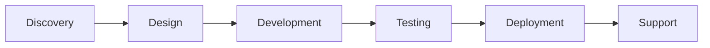

<!--
aksara:true
type: presentation
size: 16:9
meta:
    title: Company Presentation
    subtitle: ERP Solutions for Modern Business
    author: PT. Contoh Perusahaan
    date: ${new Date().toLocaleDateString('id-ID')}
theme: corporate
-->

# ERP Solutions
## for Modern Business

**PT. Contoh Perusahaan**
${new Date().toLocaleDateString('id-ID')}

---

## About Us

### Who We Are

- **Founded:** 2013
- **Team Size:** 50+ professionals
- **Clients:** 100+ companies
- **Industry:** Enterprise Software Solutions

---

## Our Expertise

### Core Competencies

1. **ERP Development**
   - Custom solutions
   - Industry-specific modules

2. **System Integration**
   - Legacy system migration
   - Third-party integrations

3. **Consulting Services**
   - Business process optimization
   - Digital transformation

---

## Product Overview

### ERP Module Suite

| Module | Features | Benefits |
|--------|----------|----------|
| Finance | GL, AP/AR, Cash | Real-time financial visibility |
| HR | Payroll, Attendance | Streamlined HR processes |
| Inventory | Stock, Warehouse | Optimized inventory management |
| Sales | CRM, Orders | Increased sales efficiency |

---

## Why Choose Us

### Competitive Advantages

✓ **Proven Track Record**
- 100+ successful implementations
- 98% client satisfaction rate

✓ **Expert Team**
- Certified professionals
- 10+ years average experience

✓ **Local Support**
- Indonesian language
- Local business understanding
- 24/7 support

---

## Case Study

### Client Success Story

**Client:** PT. Manufacturing Indonesia
**Challenge:** Manual processes, scattered data
**Solution:** Integrated ERP system

**Results:**
- ⬇️ 40% reduction in processing time
- ⬆️ 60% improvement in data accuracy
- 💰 ROI achieved in 18 months

---

## Implementation Process

### Our Proven Methodology

**Timeline:** Typically 3-6 months depending on scope

---

## Pricing Plans

### Flexible Investment Options

**Starter Package**
- Basic modules
- Up to 10 users
- **Rp 150 juta**

**Business Package**
- All modules
- Up to 50 users
- **Rp 350 juta**

**Enterprise Package**
- Custom modules
- Unlimited users
- **Custom pricing**

*All packages include 1 year support & maintenance*

---

## Client Testimonials

> "The ERP system transformed our operations. Highly recommended!"
>
> **— CEO, PT. Retail Nusantara**

> "Professional team, excellent support, great product."
>
> **— CFO, PT. Export Indonesia**

> "Best investment we made for our digital transformation."
>
> **— Director, PT. Logistics Solutions**

---

## Technology Stack

### Modern & Reliable

**Backend:**
- Node.js / Python
- PostgreSQL / MongoDB
- Redis cache

**Frontend:**
- React / Vue.js
- Progressive Web App
- Mobile responsive

**Infrastructure:**
- Cloud-ready (AWS/Azure/GCP)
- Auto-scaling
- High availability

---

## Next Steps

### Let's Start Your Digital Journey

1. **Schedule Consultation**
   - Free 1-hour session
   - Understand your needs

2. **Get Proposal**
   - Customized solution
   - Detailed pricing

3. **Pilot Project**
   - Proof of concept
   - Risk-free trial

---

## Contact Us

### Get in Touch

**Office:**
Jl. Sudirman No. 123
Jakarta Pusat 10220

**Phone:** (021) 1234-5678
**Email:** info@contohperusahaan.com
**Website:** www.contohperusahaan.com

---

# Thank You!

## Questions?

**Let's discuss how we can help your business grow**

